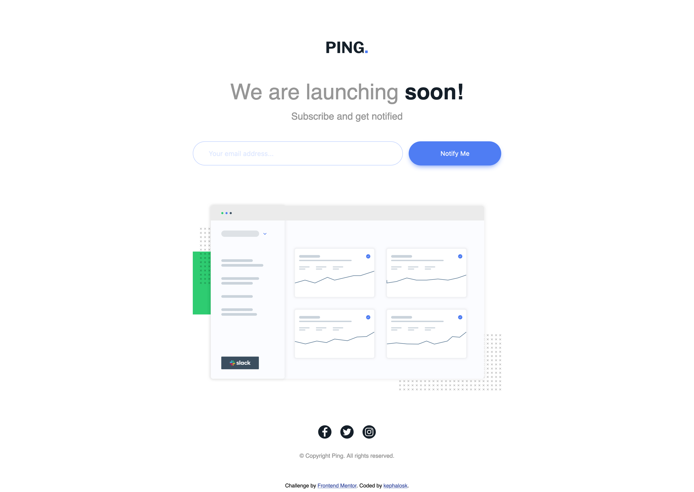
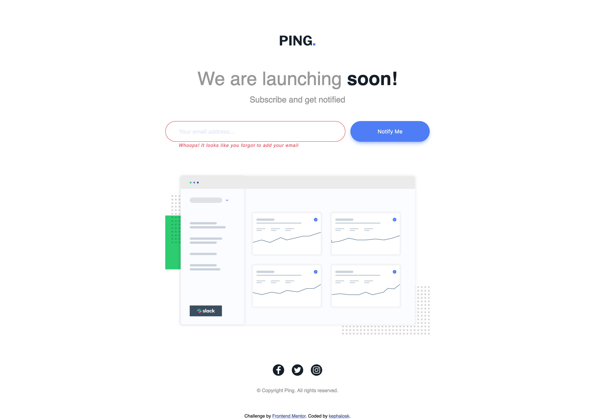
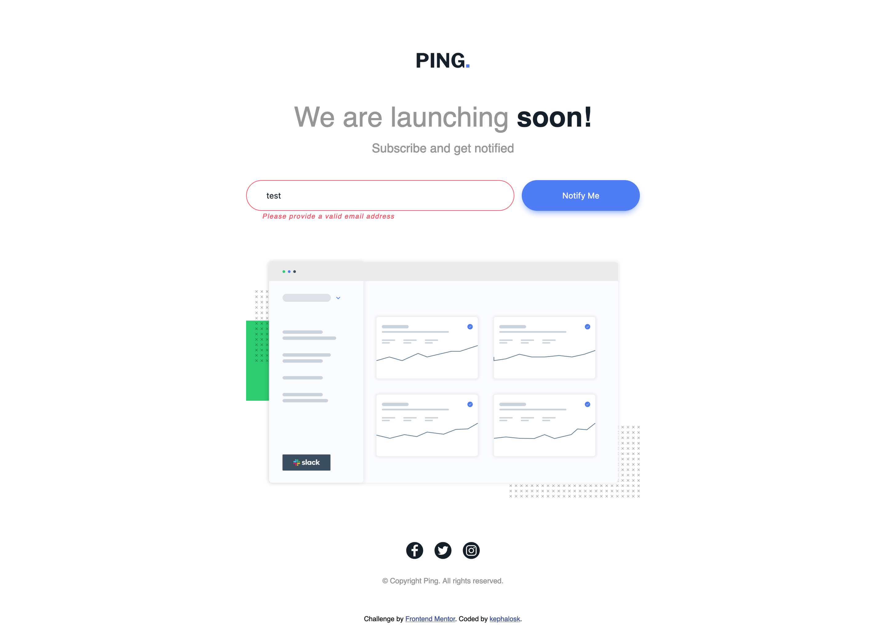
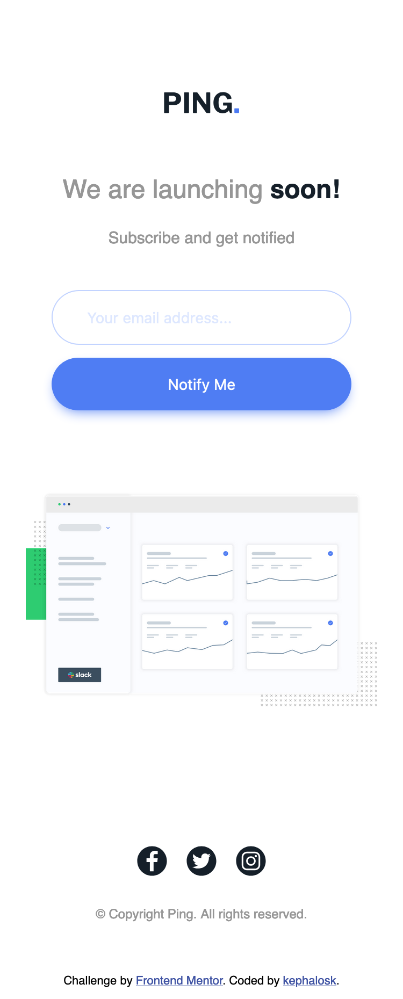
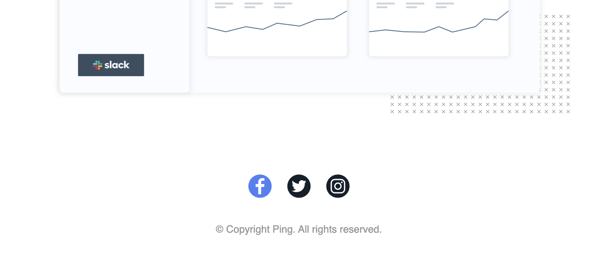
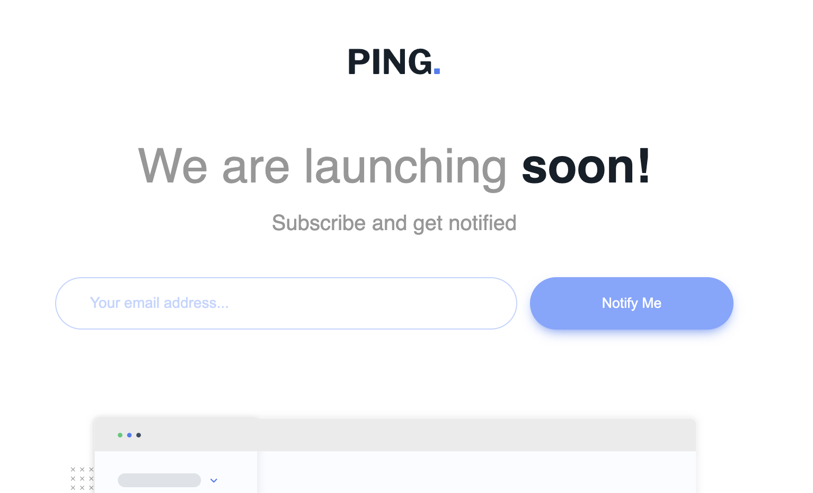

# Frontend Mentor - Social links profile solution

This is a solution to the [Blog preview card challenge on Frontend Mentor](https://www.frontendmentor.io/challenges/blog-preview-card-ckPaj01IcS/hub). Frontend Mentor challenges help you improve your coding skills by building realistic projects. 

## Table of contents

- [Overview](#overview)
  - [Screenshot](#screenshot)
  - [Links](#links)
- [My process](#my-process)
  - [Built with](#built-with)
  - [What I learned](#what-i-learned)
  - [Continued development](#continued-development)
  - [Useful resources](#useful-resources)
- [Author](#author)
- [Acknowledgments](#acknowledgments)


## Overview

### Screenshot

Desktop


Desktop Error1


Desktop Error2


Mobile


Mobile Error


Active1


Active2


### Links

- Solution URL: [Add solution URL here](https://github.com/kephalosk/ping-coming-soon-page)
- Live Site URL: [Add live site URL here](https://kephalosk.github.io/ping-coming-soon-page/)

## My process

1. download Project


2. move Project to target folder


3. open Project in IDE


4. read README


5. add .gitignore-file


6. check files


7. check design


8. initialize repo
* create repo on GitHub
* git init
* git add .
* git commit -m "initial commit"
* git remote add origin git@github.com:kephalosk/${projectname}.git
* git push -u origin master

9. check html
* build general structure
* open index.html in browser for comparison

10. check css
* image styling
* font styling
* color styling
* frame styling
* spacing styling

11. check transitions


12. check javascript


13. check mobile/responsive design


14. check accessability
* semantic html
* headings
* alternative texts
* language
* clear language
* link texts

15. extract css


16. add screenshots


17. update README


18. publish website

### Built with

- Semantic HTML5 markup
- CSS custom properties
- Desktop-first workflow

### What I learned

I learned to alter the text of a label based on an input state
```javascript
function validate() {
  if (!inputBarContentInput.value) {
    inputBarErrorLabelDesktop.textContent = messageEmpty;
    inputBarErrorLabelMobile.textContent = messageEmpty;
    addError();
    return;
  }

  if (isValidEmail(inputBarContentInput.value)) {
    removeError();
  } else {
    inputBarErrorLabelDesktop.textContent = messageInvalid;
    inputBarErrorLabelMobile.textContent = messageInvalid;
    addError();
  }

  this.blur();
}
```

I learned to set svgs inline to change their color instead of using  that doesnt allow to overwrite the color:
```html
<div class="footerSocialBar">
<svg tabindex="3" class="footerSocialBarIcon footerSocialBarIconFacebook" fill="hsl(209, 33%, 12%)" version="1.1" id="Layer_1" xmlns="http://www.w3.org/2000/svg" xmlns:xlink="http://www.w3.org/1999/xlink"
width="32px" height="32px" viewBox="0 0 260 260" enable-background="new 0 0 260 260" xml:space="preserve">
<path d="M130,2C59.308,2,2,59.308,2,130s57.308,128,128,128s128-57.308,128-128S200.692,2,130,2z M179,71h-24
c-6.627,0-12,5.373-12,12v24h36l-4,32h-32v80h-32v-80H82v-32h29V82.352c0-23.519,19.798-42.188,43.277-40.806L179,43V71z"/>
</svg>
<svg tabindex="5" class="footerSocialBarIcon footerSocialBarIconTwitter" fill="hsl(209, 33%, 12%)" version="1.1" id="Layer_1" xmlns="http://www.w3.org/2000/svg" xmlns:xlink="http://www.w3.org/1999/xlink"
width="32px" height="32px" viewBox="0 0 260 260" enable-background="new 0 0 260 260" xml:space="preserve">
<path d="M130,2C59.31,2,2,59.31,2,130s57.31,128,128,128s128-57.31,128-128S200.69,2,130,2z M194.08,97.09l0.11,4.28
c0,50.62-33.26,94.13-94.12,94.13c-18.69,0-36.07-5.48-50.71-14.89c2.59,0.3,5.22,0.46,7.89,0.46c15.5,0,29.77-5.27,41.08-14.14
c-14.47-0.26-26.43-9.08-30.64-22.23c5.11,0.82,11.26,0.12,14.69-1.29c-7.56-1.53-14.19-5.63-18.94-11.36
c-4.74-5.72-7.59-13.07-7.59-21.08c4.46,2.48,9.56,3.55,14.98,3.74c-8.87-5.93-14.71-16.06-14.71-27.54
c0-6.06,1.62-11.75,4.47-16.62c16.32,20.01,40.7,33.18,68.19,34.56c-0.57-2.42-0.86-4.95-0.86-7.54c0-18.26,14.82-33.07,33.09-33.07
c9.52,0,17.54,3.99,23.11,9.42c6.25-0.21,14.88-3.21,22.05-7c-2.47,7.71-7.71,14.2-14.54,18.29c6.69-0.26,12.43-1.65,18.36-4.28
C205.57,87.56,200.58,92.46,194.08,97.09z"/>
</svg>
<svg tabindex="4" class="footerSocialBarIcon footerSocialBarIconInstagram" fill="hsl(209, 33%, 12%)" version="1.1" id="Layer_1" xmlns="http://www.w3.org/2000/svg" xmlns:xlink="http://www.w3.org/1999/xlink"
width="32px" height="32px" viewBox="0 0 260 260" enable-background="new 0 0 260 260" xml:space="preserve">
<path d="M164.58,64H95.42C78.1,64,64,78.1,64,95.42v69.16C64,181.9,78.1,196,95.42,196h69.16c17.32,0,31.42-14.1,31.42-31.42V95.42
C196,78.1,181.9,64,164.58,64z M130,171.1c-22.66,0-41.1-18.44-41.1-41.1s18.44-41.1,41.1-41.1s41.1,18.44,41.1,41.1
S152.66,171.1,130,171.1z M172.22,97.3c-5.3,0-9.6-4.3-9.6-9.61c0-5.3,4.3-9.6,9.6-9.6c5.31,0,9.61,4.3,9.61,9.6
C181.83,93,177.53,97.3,172.22,97.3z M130,102.9c-14.94,0-27.1,12.16-27.1,27.1s12.16,27.1,27.1,27.1s27.1-12.16,27.1-27.1
S144.94,102.9,130,102.9z M130,2C59.31,2,2,59.31,2,130s57.31,128,128,128s128-57.31,128-128S200.69,2,130,2z M210,164.58
c0,25.04-20.38,45.42-45.42,45.42H95.42C70.38,210,50,189.62,50,164.58V95.42C50,70.38,70.38,50,95.42,50h69.16
C189.62,50,210,70.38,210,95.42V164.58z"/>
</svg>
</div>
```

I improved html, css and javascript skills in general.

### Continued development

* improve html
* improve css

### Useful resources

- [w3schools](https://www.w3schools.com/) - HTML and CSS knowledge
- [selfhtml](https://wiki.selfhtml.org/wiki/HTML) - HTML knowledge

## Author

- Website - [kephalosk](https://easywebpath.com)
- Frontend Mentor - [@yourusername](https://www.frontendmentor.io/profile/yourusername)
- Twitter - [@yourusername](https://www.twitter.com/yourusername)

## Acknowledgments

None.